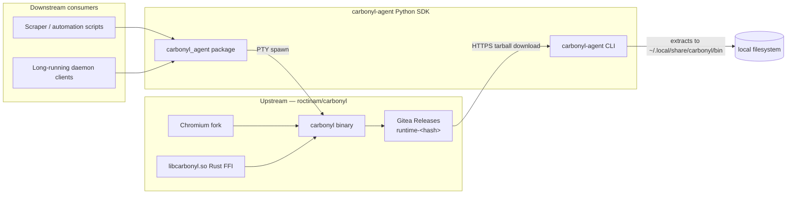
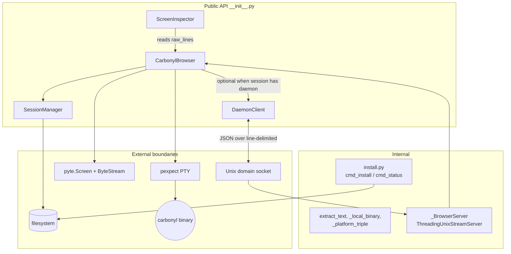
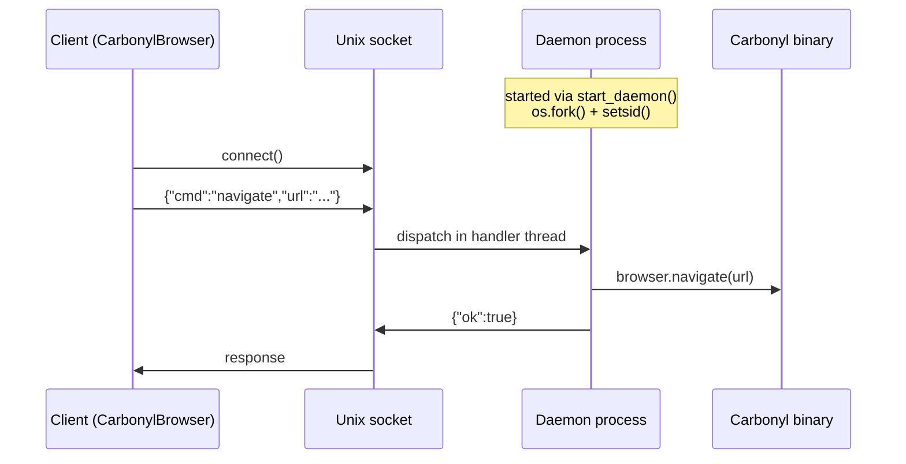

# Software Architecture Document — carbonyl-agent

**Version**: 1.0 (Baselined)
**Date**: 2026-04-09
**Status**: Accepted
**Project**: carbonyl-agent (Python automation SDK for the Carbonyl headless browser)
**Repository**: `roctinam/carbonyl-agent` (Gitea) / `jmagly/carbonyl-agent` (GitHub mirror)

---

## 1. Introduction

### 1.1 Purpose

This Software Architecture Document (SAD) describes the architecture of `carbonyl-agent`, a Python SDK that provides programmatic control over the [Carbonyl](https://git.integrolabs.net/roctinam/carbonyl) headless Chromium browser. It captures the significant architectural decisions, component structure, runtime views, and cross-cutting concerns required for contributors to understand, maintain, and extend the package.

### 1.2 Scope

The architecture described here covers only the Python automation layer: the `carbonyl_agent` package, its CLI installer, and its runtime interaction with an external Carbonyl binary. It explicitly does **not** cover the Chromium build system, the Rust FFI layer (`libcarbonyl.so`), or the Carbonyl binary itself, all of which live in the upstream `roctinam/carbonyl` repository.

### 1.3 Audience

- Contributors maintaining `carbonyl-agent`
- Downstream developers embedding the SDK in scrapers, agents, and automation pipelines
- Security reviewers validating supply-chain and sandboxing posture
- The AIWG SDLC agent pipeline consuming this artifact for traceability

### 1.4 References

- `README.md`, `CLAUDE.md`, `pyproject.toml`
- `.aiwg/intake/project-intake.md`
- Source tree: `src/carbonyl_agent/` (browser.py, daemon.py, session.py, screen_inspector.py, install.py)
- ADR-001 through ADR-004 (this directory)
- Upstream: `roctinam/carbonyl` (Chromium fork + Rust FFI)

---

## 2. Architectural Goals and Constraints

| # | Goal / Constraint | Rationale |
|---|---|---|
| G1 | **Python-only surface** | The SDK must be a pip-installable pure-Python package (`pyproject.toml` line 10). No compiled extensions — Carbonyl itself provides the native footprint. |
| G2 | **Library-first, service-optional** | Primary use is in-process as an import; the daemon is an opt-in convenience (`daemon.py`). |
| G3 | **Minimal runtime dependencies** | Only `pexpect>=4.9` and `pyte>=0.8` (pyproject.toml lines 12–15). Keeps supply-chain attack surface small and installation friction low. |
| G4 | **Cross-platform runtime discovery** | Support Linux (glibc) and macOS triples with a deterministic search order (browser.py `_local_binary`, lines 79–107). |
| G5 | **Zero binary modifications** | The SDK must drive the upstream Carbonyl binary as-is, without patches or rebuilds. Decouples SDK releases from Chromium release cycles. |
| G6 | **Local-only execution boundary** | The daemon is strictly local; authentication relies on filesystem permissions of the Unix socket. |
| G7 | **Supply-chain integrity** | Runtime binary is downloaded over HTTPS from Gitea releases (install.py line 24). SHA256 checksum verification is enforced before extraction (install.py `_verify_checksum`). |
| G8 | **Graceful fallback** | When no local binary is installed, fall back to Docker (`fathyb/carbonyl`) so first-time users can smoke-test without the installer (browser.py lines 227–248). |

---

## 3. System Context



`carbonyl-agent` sits between the upstream Carbonyl runtime and Python automation consumers. It has a one-way consumption relationship with `roctinam/carbonyl`: the SDK downloads runtime tarballs tagged `runtime-<hash>` but never modifies upstream code. `carbonyl-fleet` (Rust) does not depend on `carbonyl-agent`; the two are peer consumers of the same binary.

---

## 4. Logical View



**Key modules** (LoC approximate):

| Module | File | LoC | Responsibility |
|---|---|---|---|
| CarbonylBrowser | `browser.py` | ~650 | PTY lifecycle, pyte feed, text extraction, navigation, mouse/keyboard input, daemon passthrough |
| SessionManager | `session.py` | ~513 | Named user-data-dir CRUD, fork/snapshot/restore, SingletonLock liveness check, name validation |
| DaemonClient + daemon server | `daemon.py` | ~537 | Unix-socket RPC, fork daemon, JSON wire protocol, socket permission hardening |
| ScreenInspector | `screen_inspector.py` | ~364 | Raw-buffer coordinate visualisation, region summaries, crosshair/dot-map |
| Installer | `install.py` | ~268 | Tarball download from Gitea, SHA256 verification, tag resolution, extraction |
| CLI entry | `__main__.py` | — | `carbonyl-agent install / status` dispatch |

`CarbonylBrowser` acts as a polymorphic frontend: every public method checks `self._daemon_client` first and short-circuits to the RPC client when connected (e.g. browser.py lines 252–253, 267–269, 281–283). This lets callers use the same object regardless of whether the browser is in-process or behind a daemon.

---

## 5. Process View

### 5.1 Library mode (default)

A single Python process imports `CarbonylBrowser`, calls `open(url)`, and pexpect spawns the Carbonyl binary as a child PTY (browser.py lines 219–226). All I/O is synchronous: `drain(seconds)` pumps bytes into the pyte ByteStream until the deadline (lines 250–264). There is no background thread.

### 5.2 Daemon mode



`start_daemon` (daemon.py lines 354–400) uses `os.fork()` + `os.setsid()` to detach, redirects stdio to `/dev/null`, then runs `_BrowserServer` (a `ThreadingUnixStreamServer` with `daemon_threads=True`). The handler loop is per-connection but the underlying `CarbonylBrowser` is a single shared instance — concurrent handler threads are not synchronised. In practice the SDK is used with one client per daemon, so contention has not been a production concern. An explicit lock is tracked as future work (§11).

Graceful shutdown: the `close` command sets `shutdown_requested` (line 261), a watcher thread calls `server.shutdown()`, and `atexit` handlers unlink the socket and call `browser.close()` (lines 327–335).

---

## 6. Deployment View

```text
pip install carbonyl-agent
└── site-packages/carbonyl_agent/     (pure Python, ~2.3k LoC)

carbonyl-agent install
└── ~/.local/share/carbonyl/
    ├── bin/
    │   └── <triple>/                 # e.g. x86_64-unknown-linux-gnu
    │       ├── carbonyl              # native binary, chmod +x
    │       └── libcarbonyl.so        # LD_LIBRARY_PATH target
    └── sessions/
        ├── <name>/
        │   ├── session.json          # SessionMeta (id, name, created_at, tags, …)
        │   └── profile/              # Chromium --user-data-dir
        └── <name>.sock               # daemon Unix socket
```

The Python wheel is a standard pure-Python package built with hatchling. The runtime binary is intentionally **not** bundled with the wheel — at ~75 MB per platform triple it would blow past PyPI size limits and force a wheel-per-triple. Instead the `carbonyl-agent install` subcommand downloads the platform-specific tarball from `roctinam/carbonyl` releases (install.py `cmd_install`). See ADR-004.

`LD_LIBRARY_PATH` is set to the binary's parent directory at spawn time (browser.py line 217) so `libcarbonyl.so` resolves without requiring a system-wide install.

---

## 7. Data View

`carbonyl-agent` owns no database. Its persistent state is entirely filesystem-backed:

| Data | Location | Owner | Lifecycle |
|---|---|---|---|
| Runtime binary + shared object | `~/.local/share/carbonyl/bin/<triple>/` | install.py | Replaced on `install --force`; never deleted automatically |
| Session metadata | `~/.local/share/carbonyl/sessions/<name>/session.json` | SessionManager | Created by `create()`, deleted by `destroy()` |
| Chromium user-data-dir | `~/.local/share/carbonyl/sessions/<name>/profile/` | Chromium (via SDK) | Holds cookies, localStorage, IndexedDB, SingletonLock |
| Daemon Unix socket | `~/.local/share/carbonyl/sessions/<name>.sock` | daemon server | Created on start, unlinked on shutdown |
| Downloaded tarball | `$TMPDIR/tmpXXXX.tgz` | install.py | Deleted in `finally:` (install.py line 113) |

The SingletonLock symlink inside a Chromium profile (`<profile>/SingletonLock`) is read by `SessionManager.is_live` (session.py lines 312–320, 335–360) to detect whether the session is currently owned by a live Chromium PID — this gates destructive operations (destroy, fork, restore) to avoid corrupting a running profile.

---

## 8. Cross-Cutting Concerns

**Logging**: A minimal `log(msg)` function (browser.py line 589) writes to stderr with a `[carbonyl]` prefix. No structured logging, no log levels. Adequate for a developer SDK; downstream consumers can wrap or silence.

**Error handling**: Exceptions propagate to callers except in the daemon handler, which catches and returns `{"ok": false, "error": str(exc)}` (daemon.py line 203). Cleanup paths (`close`, `_cleanup`, stale socket unlink) swallow exceptions intentionally to guarantee resource release.

**Runtime discovery**: The four-step order (ADR-003) is applied uniformly in `_local_binary` (browser.py lines 79–107). The Docker fallback is invoked only if steps 1–3 return None.

**Supply-chain trust**: HTTPS to Gitea (`GITEA_BASE` env-overridable at install.py line 24). The installer downloads `SHA256SUMS` from the release and verifies the tarball checksum before extraction (`_verify_checksum`). Manual checksum pinning is also supported via `--checksum <hex>`. Docker fallback requires explicit opt-in (`CARBONYL_ALLOW_DOCKER=1`) and uses a pinned image digest.

**Signal handling and cleanup**: `CarbonylBrowser.close` (lines 514–550) sends SIGTERM to the Chromium process group when a session is in use (so Chromium can flush cookies), waits up to `graceful_timeout`, then SIGKILLs. The daemon registers an `atexit` hook (daemon.py line 335) to unlink the socket and close the browser even on abnormal termination.

**Sandboxing**: `CarbonylBrowser` passes `--no-sandbox` to Chromium by default (browser.py line 202) because the expected deployment is inside a container or user account that already provides the boundary. This is a documented trade-off, not an oversight.

---

## 9. Use Case Coverage

| UC | Name | Primary modules | Key entry points |
|---|---|---|---|
| UC-001 | Open a URL and extract text | `browser.py` | `CarbonylBrowser.open`, `drain`, `page_text` |
| UC-002 | Search and submit forms | `browser.py` | `send`, `send_key`, `click_text` |
| UC-003 | Persist session across runs | `session.py`, `browser.py` | `SessionManager.create`, `CarbonylBrowser(session=...)` |
| UC-004 | Fork/snapshot/restore a session | `session.py` | `fork`, `snapshot`, `restore` |
| UC-005 | Run a persistent daemon | `daemon.py` | `start_daemon`, `DaemonClient` |
| UC-006 | Visualise click coordinates | `screen_inspector.py` | `ScreenInspector.print_grid`, `crosshair`, `dot_map` |
| UC-007 | Install/update runtime binary | `install.py`, `__main__.py` | `carbonyl-agent install`, `carbonyl-agent status` |

---

## 10. Quality Attribute Scenarios

**Performance** — With a single in-process browser on commodity hardware, `open()` + 8 s drain + `page_text()` for `example.com` completes within the Carbonyl startup time (dominated by Chromium cold-start, not SDK overhead). The SDK adds negligible CPU; `extract_text` runs in O(rows × cols) per call.

**Reliability** — Stale SingletonLock cleanup (`clean_stale_lock`, session.py lines 322–333) prevents the most common "session stuck live" failure after a crash. Daemon socket staleness is handled in `is_daemon_live` (daemon.py lines 68–81) by attempting a connect and unlinking on failure.

**Security** — Threat model is local-user only. Daemon sockets are restricted to `0600` with parent dir `0700`; file-system permissions are the access boundary. Runtime download is verified via SHA256 checksums. Session names are validated against path traversal. Docker fallback requires explicit opt-in.

**Portability** — Binary discovery handles `x86_64-unknown-linux-gnu`, `aarch64-unknown-linux-gnu`, and `*-apple-darwin` triples (browser.py `_platform_triple`, lines 68–76). Windows is unsupported (pexpect + Unix sockets); WSL is expected to work via the Linux path.

---

## 11. Technical Debt and Future Work

1. ~~**SHA256 verification of runtime tarballs**~~ — **Resolved** in Iteration 1 (install.py `_verify_checksum`). SHA256SUMS downloaded and verified before extraction; `--checksum` override available.
2. **Daemon concurrency** — `_BrowserServer` uses threaded handlers but the browser is shared without a lock. Either serialise dispatch with a mutex or document "single client per daemon."
3. ~~**Expanded test coverage**~~ — **Partially resolved** in Iteration 1. 155 tests across 6 test files (unit, integration, property). Remaining gap: E2E tests with real Carbonyl binary (tracked in #15).
4. ~~**Typed public API**~~ — **Resolved** in Iteration 1. `mypy --strict` passes across all 7 source files. `py.typed` PEP 561 marker added. `TypedDict`/dataclass promotion deferred to Iteration 3.
5. **Async daemon interface** — Current daemon is blocking per-call. An `asyncio` client would let downstream agents overlap I/O with navigation.
6. **Windows support** — Requires replacing pexpect + Unix sockets with a `subprocess`/`asyncio` + named-pipe backend. Out of scope for v0.x.

---

*End of document. Baselined 2026-04-09 as v1.0.*
