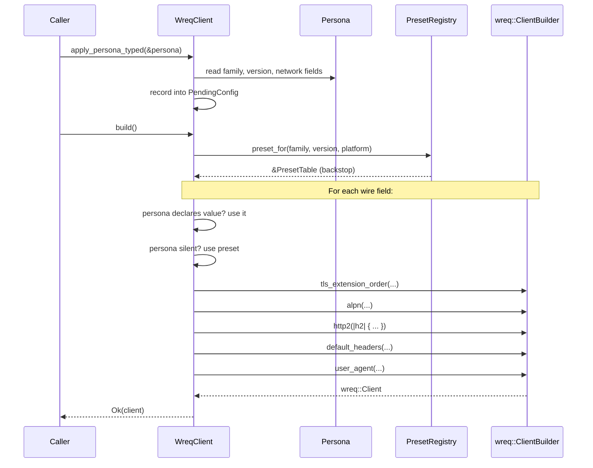

# ADR-W02: Persona Is the Source of Truth; Presets Are Data Backstops

**Status**: Proposed
**Date**: 2026-05-15
**Track**: wreq-util-replacement
**Deciders**: carbonyl-agent maintainer (sole)
**Refs**: roctinam/carbonyl-agent#99, @.aiwg/architecture/adr-005-tls-fingerprint-http-client.md §"Persona binding contract"

## Context

The current `crates/carbonyl-wreq/src/client.rs::persona_to_emulation` (lines 231–251) implements a "closest-preset-then-override" model:

1. Inspect `persona.browser_family` + `os_family`.
2. Pick the nearest `wreq_util::Emulation` enum variant (Chrome137 stands in for Chrome 147; Firefox139 stands in for Firefox 150; etc.).
3. Apply h2 SETTINGS overrides from `persona.network.http2_akamai` on top.
4. Apply UA / UA-CH default headers.

This is a *closest-preset* model: the preset drives wire shape, and the persona patches it where it can.

With UC-W01 vending its own preset registry, we own all the data. The architectural question is: do we keep the closest-preset model (preset-first, persona-override), or invert it (persona-first, preset-fill-in)?

## Decision

**Persona is the source of truth. Presets are data backstops for fields the persona does not declare.**

The new model:

1. Inspect persona fields.
2. For each wire field the persona declares (JA4, ALPN, h2 SETTINGS, headers), apply directly to `wreq::ClientBuilder`.
3. For wire fields the persona does NOT declare (ClientHello extension order beyond JA4's information content, GREASE positions, pseudo-header ordering — these are derived from family/version/platform), look up the matching preset and use its values.
4. The preset is selected by exact `(family, version, platform)` match. If no exact match, the nearest neighbor is chosen and a `tracing::warn!` is emitted.

The reversal matters because:

- The persona schema (W3A) was designed to be authoritative. Treating it as a patch-on-top contradicts the schema's design intent.
- When a persona declares a JA4 the registry has not seen (a future Chrome version, a customized fingerprint, an experimental profile), the persona-first model continues to work; the closest-preset model would silently substitute someone else's fingerprint.
- It collapses the two-step path (preset → override) into a one-step path (persona → setter), simplifying the build code and the conformance assertions.

## Consequences

### Positive

- `WreqClient::build` is mechanically simpler: walk the persona, set wreq fields.
- Conformance tests assert persona-to-wire fidelity directly. No double bookkeeping ("did the preset get there first, did the override land second").
- The registry shrinks in conceptual surface: it's a *default-values table*, not a *behavior-defining table*.
- New browser versions can be added with persona-only edits if the wire shape is similar enough to an existing preset (no registry entry needed for minor revisions).

### Negative

- Personas in production today have not been validated to declare every wire field with sufficient fidelity. If a persona omits a field (e.g., does not declare ALPN), we fall through to preset. This is fine in steady state but means the persona schema's optional-field semantics need a hard look during Iteration A.
- The "nearest-neighbor preset" fallback (when persona declares Chrome 148 but registry has only Chrome 147) is a *fallback*, not a primary path. Code must make this visible to operators via tracing, not paper over it.

### Neutral

- Backward compatibility with the W3B Phase 2.2 mapping behavior is preserved by ensuring the five canonical fixtures continue to produce identical wire output before and after the inversion. The conformance suite is the regression gate.

## Trade-off vs. keeping closest-preset selection

The closest-preset model has one real advantage: it provides a known-working wire shape when persona data is incomplete. The persona-first model relies on the persona being complete, with the preset filling gaps.

The mitigation is structural: every preset has the same set of fields as a complete persona. Falling through to preset is identical, byte-for-byte, to what the closest-preset model would have produced. The difference is only *who is in charge*, not *what wire bytes get emitted*. The conformance suite proves the equivalence on the five canonical fixtures.

If the persona schema later evolves to make fields more optional (e.g., a "minimal persona" that declares only family/version), the persona-first model continues to behave correctly — the preset fills in. The closest-preset model would also continue to work but with confusing override-precedence semantics.

## Reasoning

1. **Problem Analysis**: We have two equivalent-on-paper models. The question is which one matches the schema's design intent and produces simpler code.
2. **Constraint Identification**: Must not regress the five-family conformance. Must keep the persona schema unchanged. Must produce simpler `build()` code, not more complex.
3. **Alternative Consideration**: (a) Keep closest-preset with override — works, but contradicts the persona schema's "source of truth" framing in ADR-005. (b) Invert to persona-first, preset-backstop — selected. (c) Hybrid (persona-first for some fields, preset-first for others) — rejected, introduces a per-field policy table that's hard to reason about.
4. **Decision Rationale**: ADR-005 §"Persona binding contract" explicitly frames the persona as the source of truth. This ADR aligns the implementation with the design intent.
5. **Risk Assessment**: If personas in production omit fields, behavior may drift compared to the closest-preset path. Mitigation: Iteration A audits the existing five canonical personas for field completeness before flipping the inversion; gaps are filled in the persona before code change, not after.

## Sequence diagram

## References

- @.aiwg/tracks/wreq-util-replacement/requirements/use-cases/UC-W02-persona-to-wreq-direct.md - Direct wiring UC
- @.aiwg/tracks/wreq-util-replacement/architecture/adr-001-preset-registry-design.md - Registry shape
- @.aiwg/tracks/wreq-util-replacement/architecture/design-preset-registry.md - Concrete types
- @.aiwg/architecture/adr-005-tls-fingerprint-http-client.md §"Persona binding contract" - Original framing
- @crates/carbonyl-wreq/src/client.rs lines 100–161 - Current build flow being replaced
