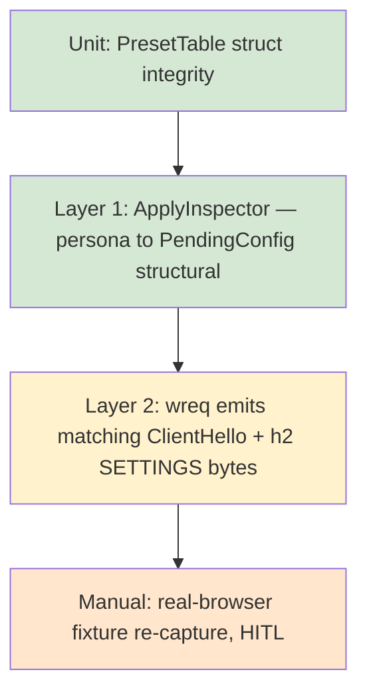

# ADR-W03: Wire-Conformance Coverage Strategy

**Status**: Proposed
**Date**: 2026-05-15
**Track**: wreq-util-replacement
**Deciders**: carbonyl-agent maintainer (sole)
**Refs**: roctinam/carbonyl-agent#99, W3B Phase 2.5 (#84) — existing Layer 2 conformance crate

## Context

UC-W03 requires wire-level verification that the new in-house registry + direct-wired `WreqClient` produces output behaviorally equivalent to real browser captures. The existing W3B Phase 2 conformance infrastructure provides two layers:

- **Layer 1**: Structural assertions via `ApplyInspector` — confirms that the recorded `PendingConfig` matches the persona spec (no wire I/O).
- **Layer 2**: Captured-output comparison — confirms that an actual `wreq` request emits a ClientHello + h2 SETTINGS frame matching a fixture.

The question this ADR answers: **how do we verify that the registry-driven `WreqClient` is behaviorally equivalent to a real browser, given that we can't run real browsers in CI?**

Three options were evaluated.

### Option A: Snapshot tests against captured fixtures

Reference fixtures are captured once per browser version from a real browser, stored under `crates/carbonyl-wreq/tests/fixtures/`, and compared byte-for-byte (modulo a tolerance set) at test time.

**Pros**: deterministic, offline, fast (no real browser invocation in CI), cross-checks against external JA4 databases provide a second opinion on fixture correctness.
**Cons**: fixtures go stale when browsers update; capture process is a HITL gate; tolerance set requires care.

### Option B: Golden-output tests (regenerable from a fixture-build job)

Tests run against a captured fixture; on intentional drift, the developer runs `cargo test -- --fixtures-update` and the fixture is regenerated from a known-good source. CI runs read-only.

**Pros**: lower friction when intentionally updating a preset.
**Cons**: the "known-good source" is still a HITL capture — this is option A with an extra CLI step. Same fundamental constraint.

### Option C: Differential testing against real browsers in CI

CI spins up Chrome/Firefox/Safari in containers, makes a request against the same responder, and compares wreq's output to the real browser's output live.

**Pros**: always-current, automatically detects browser-version drift.
**Cons**: requires browser containers in CI (huge images, slow startup, flaky on resource-constrained runners). Safari is essentially impossible to containerize. Mobile profiles require emulator setup. Network-egress requirements clash with offline CI runners.

## Decision

**Option A: Snapshot tests against captured fixtures, with cross-checks against published JA4 databases.**

Fixtures are captured by a documented HITL procedure (`fixtures-plan.md`). Each fixture's JA4 is cross-validated against at least one external corpus (FoxIO JA4 database or equivalent) before commit. Tolerance handling is per-field via `divergences.toml`.

Layer 2 in CI:

1. Starts a local TLS responder bound to localhost (no egress).
2. Issues a request through the constructed `wreq::Client`.
3. The responder captures the raw ClientHello + h2 SETTINGS bytes.
4. Bytes are compared to the fixture, field by field, with the tolerance set applied.

Option C is rejected for the reasons above; it could be a future enhancement when our CI environment supports containerized browsers, but it is not a Phase 2 requirement.

## Consequences

### Positive

- Reproducible offline: any developer can clone the repo and run `cargo test --workspace` to validate wire fidelity.
- Provenance: every fixture has a recorded source. Auditors can see exactly where the reference came from.
- Selective tolerance: GREASE / random fields don't cause noise; structural divergence does.
- Cheap to extend: a new browser version is a new fixture plus a new test entry — no CI machinery change.

### Negative

- Fixtures must be re-captured when browsers update significantly. We treat fixture re-capture as a manual task; the conformance test failing on an intentional persona-version bump is the prompt.
- The local TLS responder is a piece of test infrastructure we own. If it has bugs, conformance results are unreliable. Mitigation: the responder is intentionally minimal — it accepts a TLS handshake, captures bytes, returns a canned response. Total surface ~200 lines.
- Tolerance set drift: if `divergences.toml` grows too quickly, we're masking real bugs. Mitigation: each entry must have an issue link and a target close date; CI gate fails if any entry is past its close date.

### Neutral

- The fixture set IS the public, auditable record of "what we believe each browser version looks like on the wire". This is valuable on its own terms.

## Test-pyramid view

L0–L2 run in CI on every PR. L3 is on-demand, triggered by intentional persona-version bumps or by external evidence that a browser's wire shape has changed (JA4 database update).

## Tolerance set (initial)

Field-level tolerances live in `tests/conformance/divergences.toml`. Initial entries:

| Field | Tolerance | Justification |
|-------|-----------|---------------|
| TLS GREASE positions (4 ext IDs in ClientHello) | Any valid GREASE value (0x0A0A, 0x1A1A, …, 0xFAFA) | RFC 8701 — values are intentionally randomized |
| TLS random (32 bytes) | Ignored | Always ephemeral |
| Session ticket extension content | Ignored if both empty | First-request behavior |
| SNI value | Ignored | Driven by the test target host, not by the persona |
| TCP-level metadata | Ignored | Out of scope for TLS/h2 conformance |

This list grows with discovered legitimate divergence; each addition requires reviewer sign-off and an issue link.

## Reasoning

1. **Problem Analysis**: We need to prove wire fidelity in CI without running real browsers in CI. The only mechanism is captured fixtures.
2. **Constraint Identification**: Offline CI, no network egress, Safari uncontainerizable, mobile profiles require special setup.
3. **Alternative Consideration**: Live differential (Option C) is the gold standard but operationally infeasible. Golden-output (Option B) is a UX variant of snapshot (Option A) without fundamental difference.
4. **Decision Rationale**: Option A meets every constraint. The HITL fixture-capture step is honest — the wire shape of a real browser IS something a human has to observe at some point. We make that observation explicit and auditable rather than hiding it inside a CI container.
5. **Risk Assessment**: Stale fixtures = passing tests on the wrong reference. Mitigation: provenance includes capture date; a 6-month-old fixture for a major-version-bumped browser is a recapture trigger. JA4 cross-check catches gross fixture errors at capture time.

## References

- @.aiwg/tracks/wreq-util-replacement/requirements/use-cases/UC-W03-wire-conformance-coverage.md - Use case
- @.aiwg/tracks/wreq-util-replacement/testing/test-plan.md - Test strategy
- @.aiwg/tracks/wreq-util-replacement/testing/fixtures-plan.md - Capture procedure
- @crates/carbonyl-fingerprint/src/conformance.rs - ApplyInspector
- @.aiwg/architecture/adr-005-tls-fingerprint-http-client.md §"CI conformance gate"
