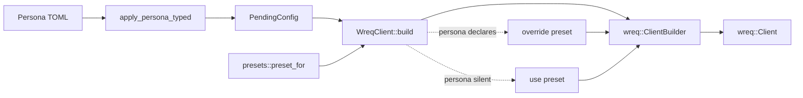

# Design: In-House Preset Registry and Direct-Wired WreqClient

**Status**: Draft
**Date**: 2026-05-15
**Track**: wreq-util-replacement
**Refs**: ADR-W01, ADR-W02, ADR-W03

This document is the concrete design for the artifacts UC-W01 and UC-W02 produce. It sketches Rust types, module layout, the build flow that replaces `client.rs::persona_to_emulation`, and the integration shape with the existing `wreq` API.

## 1. Module layout

```
crates/carbonyl-wreq/
├── Cargo.toml                       # wreq-util removed; cargo-about clean
├── src/
│   ├── lib.rs                       # pub use of client and presets
│   ├── client.rs                    # WreqClient (UC-W02 rewrite)
│   └── presets/
│       ├── mod.rs                   # types, preset_for(), Platform enum
│       ├── chrome.rs                # CHROME_147_DESKTOP, CHROME_147_MOBILE_ANDROID
│       ├── firefox.rs               # FIREFOX_150_DESKTOP
│       └── safari.rs                # SAFARI_26_MACOS, SAFARI_26_IOS
├── data/
│   └── fixtures/                    # captured wire references (Layer 2)
│       ├── chrome-147-desktop.pcap
│       ├── chrome-147-mobile.pcap
│       ├── firefox-150-desktop.pcap
│       ├── safari-26-macos.pcap
│       ├── safari-26-ios.pcap
│       └── PROVENANCE.md
└── tests/
    ├── conformance_layer1.rs        # ApplyInspector assertions
    ├── conformance_layer2.rs        # wire-byte comparison vs fixtures
    └── conformance/
        ├── responder.rs             # localhost TLS+h2 capture responder
        └── divergences.toml         # tolerated field-level divergence set
```

## 2. Core types

### 2.1 `PresetTable`

```rust
// presets/mod.rs (pseudo-code; not the final API)

#![forbid(unsafe_code)]

use carbonyl_fingerprint::schema::BrowserFamily;

/// Static preset data for one (family, version, platform) triple.
///
/// Backstop for wire fields a persona does not declare. The persona
/// remains the source of truth per ADR-W02; values here are defaults
/// derived from independent capture of real-browser behavior.
#[derive(Debug, Clone, PartialEq, Eq)]
pub struct PresetTable {
    pub family: BrowserFamily,
    pub version: BrowserVersion,
    pub platform: Platform,
    pub tls: TlsProfile,
    pub h2: H2Profile,
    pub headers: HeaderProfile,
    /// Sourced from `data/fixtures/<id>.pcap`; SHA-256 recorded in PROVENANCE.md.
    pub provenance_id: &'static str,
}

#[derive(Debug, Clone, Copy, PartialEq, Eq)]
pub struct BrowserVersion {
    pub major: u32,
    pub minor: u32,
}

#[derive(Debug, Clone, Copy, PartialEq, Eq)]
pub enum Platform {
    Desktop,
    MobileAndroid,
    MobileIos,
}

#[derive(Debug, Clone, PartialEq, Eq)]
pub struct TlsProfile {
    /// ClientHello extension IDs in order of appearance.
    pub extension_order: &'static [u16],
    /// Cipher suite list in order.
    pub cipher_order: &'static [u16],
    /// ALPN offer list (default; persona.network.alpn overrides).
    pub alpn_default: &'static [&'static str],
    /// Indexed positions within extension_order where GREASE is expected.
    pub grease_positions: &'static [usize],
    /// Supported groups (key share + named groups) in order.
    pub supported_groups: &'static [u16],
    /// Signature algorithm list in order.
    pub signature_algorithms: &'static [u16],
}

#[derive(Debug, Clone, PartialEq, Eq)]
pub struct H2Profile {
    /// Default SETTINGS entries in (id, value) tuples, in declared order.
    /// Persona.network.http2_akamai overrides on a per-(id, value) basis.
    pub settings_default: &'static [(u16, u32)],
    pub initial_connection_window: u32,
    /// Pseudo-header order for HEADERS frames (e.g. [":method", ":path", ":authority", ":scheme"]).
    pub pseudo_header_order: &'static [&'static str],
}

#[derive(Debug, Clone, PartialEq, Eq)]
pub struct HeaderProfile {
    /// Default header names in emission order. Values come from the
    /// persona (Accept-Language, User-Agent, UA-CH); this struct only
    /// fixes ordering.
    pub default_order: &'static [&'static str],
}
```

### 2.2 Lookup function

```rust
// presets/mod.rs

/// Resolve a preset for (family, version, platform).
///
/// Returns the exact match when available, otherwise the nearest
/// preset within the same family with a `tracing::warn!` event.
/// Never panics. Never returns the wrong family.
pub fn preset_for(
    family: BrowserFamily,
    version: BrowserVersion,
    platform: Platform,
) -> &'static PresetTable {
    // Exact match table (compile-time):
    match (family, version.major, platform) {
        (BrowserFamily::Chrome,  147, Platform::Desktop)       => &chrome::CHROME_147_DESKTOP,
        (BrowserFamily::Chrome,  147, Platform::MobileAndroid) => &chrome::CHROME_147_MOBILE_ANDROID,
        (BrowserFamily::Firefox, 150, Platform::Desktop)       => &firefox::FIREFOX_150_DESKTOP,
        (BrowserFamily::Safari,   26, Platform::Desktop)       => &safari::SAFARI_26_MACOS,
        (BrowserFamily::Safari,   26, Platform::MobileIos)     => &safari::SAFARI_26_IOS,
        _ => nearest_neighbor(family, version, platform),
    }
}

fn nearest_neighbor(
    family: BrowserFamily,
    version: BrowserVersion,
    platform: Platform,
) -> &'static PresetTable {
    tracing::warn!(
        target: "carbonyl_wreq::presets",
        ?family, ?version, ?platform,
        "no exact preset; substituting nearest-neighbor"
    );
    // Family-scoped fallback. Per ADR-W02 this never crosses family lines.
    match (family, platform) {
        (BrowserFamily::Chrome,  Platform::MobileAndroid) => &chrome::CHROME_147_MOBILE_ANDROID,
        (BrowserFamily::Chrome,  _)                       => &chrome::CHROME_147_DESKTOP,
        (BrowserFamily::Firefox, _)                       => &firefox::FIREFOX_150_DESKTOP,
        (BrowserFamily::Safari,  Platform::MobileIos)     => &safari::SAFARI_26_IOS,
        (BrowserFamily::Safari,  _)                       => &safari::SAFARI_26_MACOS,
    }
}
```

### 2.3 Example concrete preset (Chrome 147 desktop)

```rust
// presets/chrome.rs (illustrative; values are placeholders for the actual
// captured-from-fixture values produced by fixtures-plan.md)

use super::*;

pub static CHROME_147_DESKTOP: PresetTable = PresetTable {
    family: BrowserFamily::Chrome,
    version: BrowserVersion { major: 147, minor: 0 },
    platform: Platform::Desktop,
    tls: TlsProfile {
        // Extension order from captured ClientHello.
        // Each value is a 16-bit extension type code (RFC 8446 §4.2 + IANA).
        extension_order: &[
            // server_name=0x0000, status_request=0x0005, supported_groups=0x000A,
            // ec_point_formats=0x000B, signature_algorithms=0x000D, ...
            // FILL FROM FIXTURE
        ],
        cipher_order: &[
            // 0x1301 TLS_AES_128_GCM_SHA256, etc. FILL FROM FIXTURE.
        ],
        alpn_default: &["h2", "http/1.1"],
        grease_positions: &[0, /* and three more — FILL FROM FIXTURE */],
        supported_groups: &[/* FILL FROM FIXTURE */],
        signature_algorithms: &[/* FILL FROM FIXTURE */],
    },
    h2: H2Profile {
        settings_default: &[
            (0x01, 65536),   // HEADER_TABLE_SIZE
            (0x02, 0),       // ENABLE_PUSH
            (0x04, 6291456), // INITIAL_WINDOW_SIZE
            (0x06, 262144),  // MAX_HEADER_LIST_SIZE
            // FILL FROM FIXTURE — exact entry list and order
        ],
        initial_connection_window: 15663105,
        pseudo_header_order: &[":method", ":authority", ":scheme", ":path"],
    },
    headers: HeaderProfile {
        default_order: &[
            "host",
            "sec-ch-ua",
            "sec-ch-ua-mobile",
            "sec-ch-ua-platform",
            "upgrade-insecure-requests",
            "user-agent",
            "accept",
            "accept-encoding",
            "accept-language",
        ],
    },
    provenance_id: "chrome-147-desktop",
};
```

## 3. WreqClient build flow (post-replacement)

The new `WreqClient::build` (UC-W02) shape, contrasting with the current implementation:

```rust
// crates/carbonyl-wreq/src/client.rs (post-rewrite, illustrative)

pub struct PendingConfig {
    pub ja3: Option<String>,
    pub ja4: Option<String>,
    pub alpn: Vec<String>,
    pub h2_settings: H2Settings,
    pub h2_window: H2WindowUpdate,
    pub h2_priority: H2Priority,
    pub headers: Vec<(String, String)>,
    // emulation: Option<wreq_util::Emulation>   <-- REMOVED
    pub family: Option<BrowserFamily>,
    pub version: Option<BrowserVersion>,
    pub platform: Option<Platform>,
}

impl WreqClient {
    pub fn apply_persona_typed(&mut self, persona: &Persona) -> Result<(), FingerprintError> {
        let p = &persona.persona;
        self.pending.family = Some(p.browser_family);
        self.pending.version = Some(p.browser_version_parsed()?);
        self.pending.platform = Some(infer_platform(p));
        self.apply_persona(persona) // trait default records the rest
    }

    pub fn build(self) -> Result<wreq::Client, WreqError> {
        let preset = presets::preset_for(
            self.pending.family.unwrap_or(BrowserFamily::Chrome),
            self.pending.version.unwrap_or(BrowserVersion { major: 0, minor: 0 }),
            self.pending.platform.unwrap_or(Platform::Desktop),
        );

        let mut builder = wreq::Client::builder();

        // 1. TLS profile: persona-declared JA4 drives extension order
        //    where it can; preset fills in. (Exact wreq API method names
        //    are TBD in Iteration A — investigation gate.)
        builder = apply_tls_profile(builder, &self.pending, preset);

        // 2. ALPN: persona overrides preset default.
        let alpn = if self.pending.alpn.is_empty() {
            preset.tls.alpn_default
                .iter().map(|s| s.to_string()).collect()
        } else {
            self.pending.alpn.clone()
        };
        builder = builder.alpn(alpn);

        // 3. h2 SETTINGS: persona-declared entries override preset entries
        //    keyed by SETTINGS id. Entries not declared by persona fall
        //    through to preset.
        let merged_h2 = merge_h2_settings(&self.pending.h2_settings, preset.h2.settings_default);
        let connection_window = self.pending.h2_window.0; // persona wins; preset
                                                           // only used if persona
                                                           // recorded zero (None)
        builder = builder.http2(move |h2| apply_h2(h2, &merged_h2, connection_window));

        // 4. Default headers: persona-recorded headers in invocation
        //    order; preset's header_order provides backstop ordering
        //    when persona omits any expected header.
        builder = apply_headers(builder, &self.pending.headers, &preset.headers);

        builder.build().map_err(WreqError::Build)
    }
}
```

### 3.1 The TLS-profile open question (Iteration A investigation gate)

`wreq::ClientBuilder` does not today expose every TLS field (extension order, GREASE positions, supported groups) as a public setter — it bundles them inside `wreq`'s `Profile` / `EmulationProvider` type. The first task in Iteration A is to confirm which of the following holds:

1. `wreq` exposes a `Profile::builder()` or analogous low-level API that accepts the fields above directly. In this case the design proceeds as above; `apply_tls_profile` calls into that API.
2. `wreq` only accepts `Profile` values produced from `wreq_util::Emulation`. In this case, we either:
   - Submit an upstream PR to `wreq` exposing the lower-level API (best long-term outcome).
   - Construct a `Profile` ourselves by reading `wreq`'s internals (`wreq` is permissively licensed, so this is legally fine, but it couples us tightly to wreq's internal structure).
   - Use a small `unsafe` shim that constructs the same internal representation `wreq_util` produces — explicitly out of scope for this design (NFR-W-06 forbids unsafe).

The Iteration A construction phase begins with this investigation. The result is captured as a follow-up to ADR-W02 (an "ADR-W02-addendum-wreq-api-shape.md" if option 1 or 2 differs from expectations).

## 4. Data flow



## 5. Removal/cleanup at end of Iteration C

1. `wreq-util = "..."` removed from `crates/carbonyl-wreq/Cargo.toml`.
2. `use wreq_util::Emulation;` and `persona_to_emulation` deleted from `client.rs`.
3. `PendingConfig::emulation` field removed.
4. Module docstring in `client.rs` lines 1–33 rewritten to describe the persona-first, preset-backstop model.
5. `scripts/gen-third-party-licenses.sh` updated to scan the full workspace (drop the `carbonyl-fingerprint`-only restriction).
6. `THIRD_PARTY_LICENSES.txt` regenerated and committed.
7. Wheel rebuilt via `hatchling`; verifies the regenerated license file ships.

## 6. Open design questions (resolved during Iteration A)

| Question | Resolution path |
|----------|-----------------|
| Does `wreq` 5.x expose a low-level `Profile` builder, or must we reach into internals? | Investigation in first 2 days of Iteration A; addendum to ADR-W02 if surprising. |
| How does `wreq` express ClientHello extension ordering — by enum, by raw bytes, or by named extension structs? | Same investigation. |
| What is the persona-omits-version fallback? Today the persona always declares version; if a future persona omits it, do we default to "latest known for the family" or fail closed? | TBD — open issue, propose "fail closed" since silent defaults to "latest" mask drift. |
| Does the conformance responder need a real TLS implementation, or can it parse the ClientHello bytes statelessly? | Stateless parse is sufficient for ClientHello capture; h2 SETTINGS requires a full handshake. Two-stage responder. |

## References

- @.aiwg/tracks/wreq-util-replacement/architecture/adr-001-preset-registry-design.md
- @.aiwg/tracks/wreq-util-replacement/architecture/adr-002-persona-as-source-of-truth.md
- @.aiwg/tracks/wreq-util-replacement/architecture/adr-003-wire-conformance-coverage-strategy.md
- @.aiwg/tracks/wreq-util-replacement/requirements/use-cases/UC-W01-vendor-preset-registry.md
- @.aiwg/tracks/wreq-util-replacement/requirements/use-cases/UC-W02-persona-to-wreq-direct.md
- @.aiwg/tracks/wreq-util-replacement/testing/fixtures-plan.md
- @crates/carbonyl-wreq/src/client.rs - Current integration site
